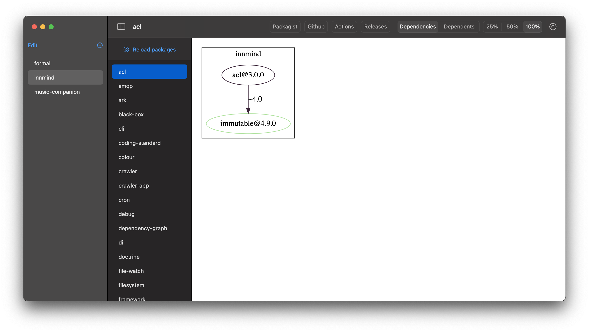
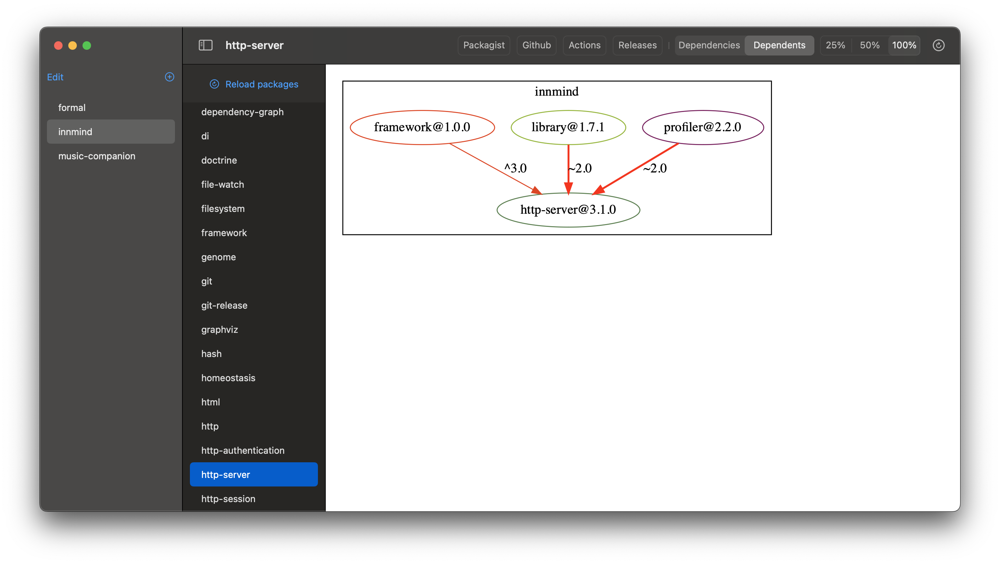

# macOS tooling

This macOS app is here to help in the development process of the Innmind organization.

It relies upon the [`dependency-graph` cli tool](https://github.com/Innmind/DependencyGraph) to generate svg files to visualize all the dependencies between the packages.

**Note**: if you want to use this app for another organization you'll need to fork this project and modify the file `Innmind/Model/ModelData.swift` and change the instanciation of the `Organization` object.

## Screenshots

